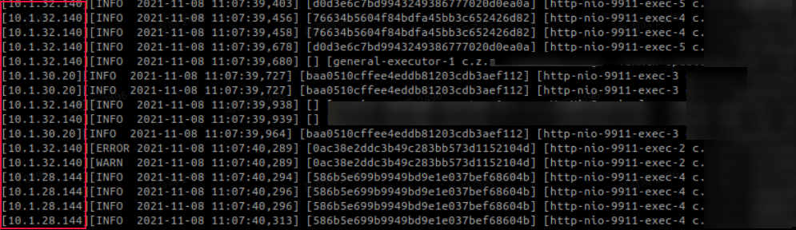
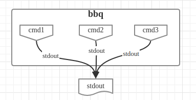

# bbq
同时指定多个命令，并将每个命令的标准输出(stdout)合并成一个标准输出(stdout)。
按行合并，因此不会出现不同命令输出到同一行的情况。

当我们上线多台服务器之后，这时候如果要与客户端/三方联调，查看log非常麻烦，因为请求可能落到其中一台。
如果我们可以同时看到所有log，那就简单多了。

这样的需求，就像烤串一样，用一根竹签，把想要的肉（日志)串起来，同时观察其中的变化！

因此，本功能实现的就是烧烤的功能，简称bbq。

# 编译安装

    gcc -Wall -O6 -ansi -std=c99 -pthread -o bbq bbq.c
    cp bbq /usr/bin/bbq

# 使用方法

将线上多台服务器同时查看

    bbq -p [10.1.28.144] "ssh 'tail -F /home/work/log/api/app.log'" \
      -p [10.1.30.20] "ssh 10.1.30.20 'tail -F /home/work/log/api/app.log'" \
      -p [10.1.32.140] "ssh 10.1.32.140 'tail -F /home/work/log/api/app.log'"

打印log的效果如下：

注意，上面我们-p指定了每行log输出的前缀，这样，不但将log合并输出，而且加上了所在机器的ip，更方便定位问题。

# 原理图

# have fun
